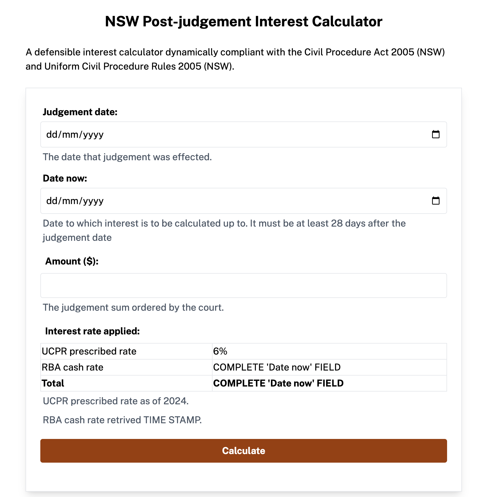

# NSW Post-judgement Interest Calculator
Making a defensible post-interest judgement calculator complaint with the Civil Procedure Act 2005 (NSW) and Uniform Civil Procedure Rules 2005 (UCPR).

TODO:
* make an API call to RBA stats and display it
* show calculation on screen
* make legislative provisions drop downs (accordian styling)

### 36.7   Payment of interest (cf SCR Part 40, rule 7)
(1)  The prescribed rate at which interest is payable under section 101 of the Civil Procedure Act 2005 is—
(a)  in respect of the period from 1 January to 30 June in any year—the rate that is 6% above the cash rate last published by the Reserve Bank of Australia before that period commenced, and
(b)  in respect of the period from 1 July to 31 December in any year—the rate that is 6% above the cash rate last published by the Reserve Bank of Australia before that period commenced.

### Technical notes:
* expressjs backend
* vite frontend
* I've configured vite so that all requests made to `/api` in the frontend are to be forwarded to the backend at `http://localhost:3001`.

